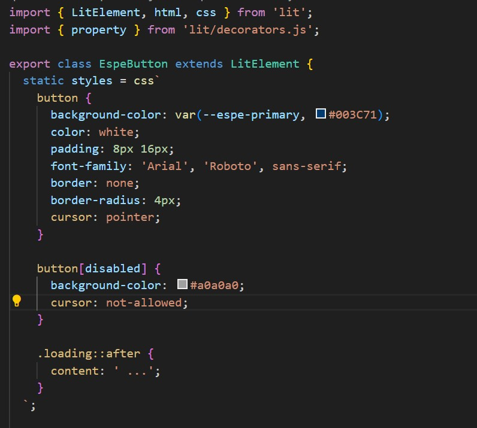
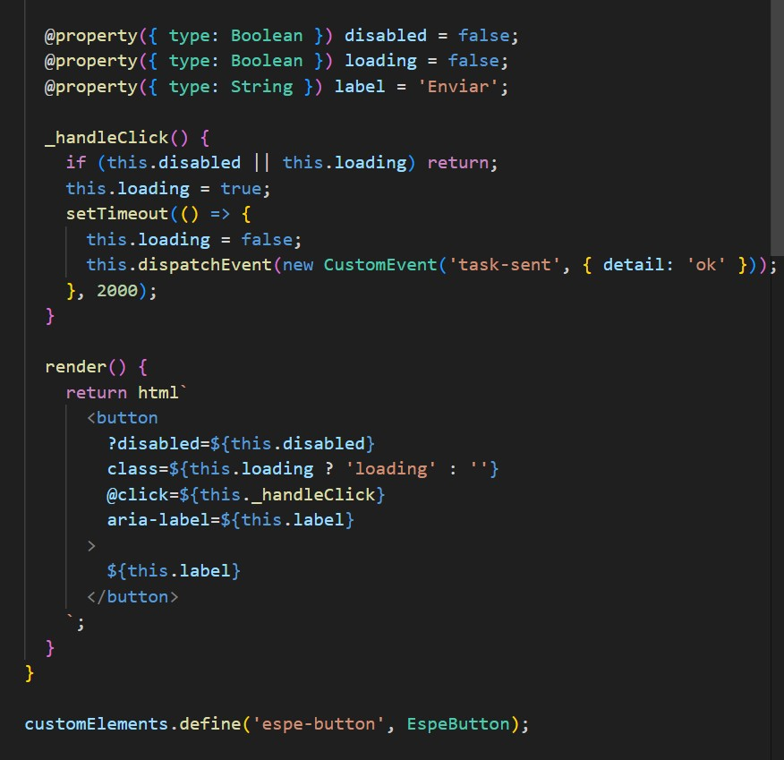

# 🟢 Informe técnico: Componente `<espe-button>` usando LitElement

### Estudiante: Giovanny Francisco Durán Sánchez  
### Asignatura: Programación Integrativa de Componentes Web  
### Docente: Ing. Paulo Galarza 
### Universidad de las Fuerzas Armadas ESPE – Sede Santo Domingo
### Rama: `tarea2-personalizar-comportamientos`


---

## 🧩 Introducción

El presente informe detalla el desarrollo del componente Web `<espe-button>`, creado con **LitElement**, el cual aplica los principios de encapsulamiento, estados dinámicos, eventos personalizados y estilos acordes al manual de imagen institucional de la ESPE. Este trabajo forma parte de la Tarea 2 de la asignatura, implementado de forma modular y versionado mediante GitHub Flow.

---

## 🎯 Objetivos

### Objetivo general
Desarrollar un componente `<espe-button>` basado en LitElement, con estados reactivos, eventos personalizados y estilos personalizados conforme a la identidad visual de la ESPE.

### Objetivos específicos
- Implementar propiedades reactivas usando el decorador `@property`.
- Aplicar Shadow DOM para encapsular estilos personalizados.
- Emitir eventos personalizados desde el componente.
- Integrar tipografía y colores institucionales.
- Aplicar GitHub Flow en el desarrollo del componente.

---

## ⚙️ Desarrollo técnico

El componente fue implementado dentro de un proyecto Vite, en el archivo `src/components/EspeButton.js`. Se utilizaron propiedades reactivas para gestionar estados como `disabled` y `loading`, y se definió un evento personalizado llamado `task-sent`.

### 🔹 Código fuente del componente

```js
import { LitElement, html, css } from 'lit';
import { property } from 'lit/decorators.js';

export class EspeButton extends LitElement {
  static styles = css`
    button {
      background-color: var(--espe-primary, #003C71);
      color: white;
      padding: 8px 16px;
      font-family: 'Arial', 'Roboto', sans-serif;
      border: none;
      border-radius: 4px;
      cursor: pointer;
    }
    button[disabled] {
      background-color: #a0a0a0;
      cursor: not-allowed;
    }
    .loading::after {
      content: ' ...';
    }
  `;

  @property({ type: Boolean }) disabled = false;
  @property({ type: Boolean }) loading = false;
  @property({ type: String }) label = 'Enviar';

  _handleClick() {
    if (this.disabled || this.loading) return;
    this.loading = true;
    setTimeout(() => {
      this.loading = false;
      this.dispatchEvent(new CustomEvent('task-sent', { detail: 'ok' }));
    }, 2000);
  }

  render() {
    return html`
      <button
        ?disabled=${this.disabled}
        class=${this.loading ? 'loading' : ''}
        @click=${this._handleClick}
        aria-label=${this.label}
      >
        ${this.label}
      </button>
    `;
  }
}

customElements.define('espe-button', EspeButton);
````

---

## 🖥️ Visualización del componente

Se desarrolló una vista básica en `index.html` para comprobar el comportamiento del componente. Al hacer clic, el botón cambia de estado a "cargando..." y luego emite un evento.

### 🔸 Captura del codigo de componente




---

## 🔁 GitHub Flow aplicado

1. Se inicializó el proyecto con Vite usando el template de Lit.
2. Se subió la rama `main` con la estructura base sin componente.
3. Se creó una nueva rama: `tarea2-personalizar-comportamientos`.
4. Se desarrolló el componente y se hizo commit con mensajes descriptivos.
5. Se realizó `push` de la rama al repositorio remoto.
6. El README fue documentado con evidencia visual y técnica.

---

## 🐞 Problemas enfrentados y solución

| Problema                          | Causa                                                         | Solución                                              |
| --------------------------------- | ------------------------------------------------------------- | ----------------------------------------------------- |
| El componente no se mostraba      | Mal importado en `main.js`                                    | Se corrigió con `import './components/EspeButton.js'` |
| Error de decoradores              | Archivo `.js` no ejecutado como módulo                        | Se usó correctamente `type="module"` y Vite           |
| No se veía el contenido del botón | Se olvidó cerrar `</button>` correctamente                    | Se corrigió el `render()`                             |
| Cambios no se reflejaban          | No se guardaban los archivos o el dev server no estaba activo | Se usó `npm run dev` y se recargó la página           |

---

## ✅ Conclusiones

* Se implementó correctamente un botón funcional, accesible y estilizado bajo los lineamientos de la ESPE.
* El uso de `@property` permitió la reactividad del componente, cambiando estado e interfaz.
* GitHub Flow facilitó un flujo limpio y profesional de control de versiones.
* El proyecto es escalable y puede extenderse a otros componentes institucionales.

---

## 💡 Recomendaciones

* Siempre usar propiedades reactivas para mantener la lógica de interfaz desacoplada.
* Validar accesibilidad desde el diseño (atributos ARIA, teclado).
* Nombrar ramas y commits con convenciones claras.
* Incluir capturas funcionales y pruebas para evidenciar funcionamiento.

---

## 📦 Instalación y ejecución del proyecto

```bash
git clone https://github.com/GiovannyGuso/Tarea2_U2_DuranGiovanny.git
cd espe-button-lit
npm install
npm run dev
```

Abrir el navegador en: [http://localhost:5173](http://localhost:5173)

---


